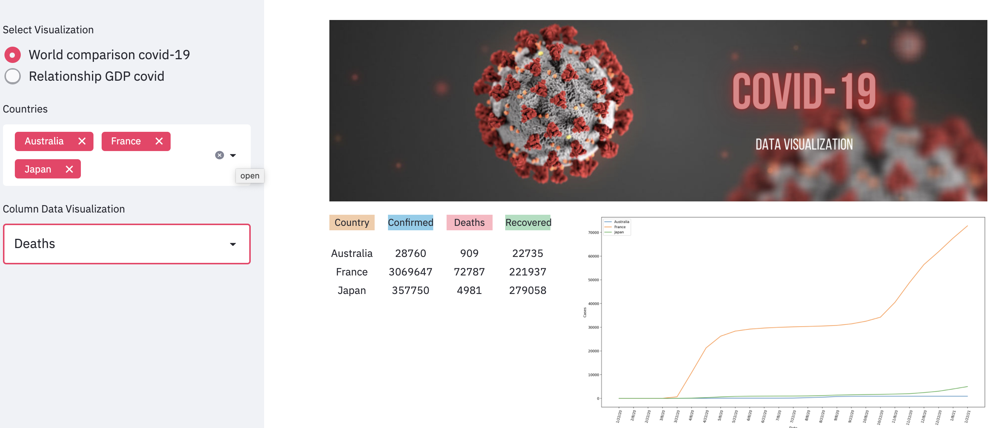

 
  

<h1 align="center"> Covid-19 </h1>
<h3 align="center"> Dashboard to view and compare pandemic data between countries </h3>  

 

<!-- TABLE OF CONTENTS -->
<h2 id="table-of-contents"> :book: Table of Contents</h2>

  
Table of Contents

  <ol>
    <li><a href="#about-the-project"> ➤ About The Project</a></li>
    <li><a href="#prerequisites"> ➤ Prerequisites</a></li>
    <li><a href="#folder-structure"> ➤ Folder Structure</a></li>
    <li><a href="#dataset"> ➤ Dataset</a></li>
        <ul>
        <li><a href="#preprocessed-data">Pre-processed data</a></li>
        </ul>
    <!--<li><a href="#experiments">Experiments</a></li>-->
    <li><a href="#Fast-API"> ➤ Fast API</a></li>
    <li><a href="#references"> ➤ References</a></li>
    <li><a href="#contributors"> ➤ Contributors</a></li>
  </ol>

<!-- ABOUT THE PROJECT -->
<h2 id="about-the-project"> :pencil: About The Project</h2>

 
This project is part of the Big Data & Machine Learning Bootcamp.
Here you can see the analysis of the Covid-19 data during the first year of the pandemic.

 
  

<!-- PREREQUISITES -->
<h2 id="prerequisites"> :fork_and_knife: Prerequisites</h2>

  

<!--This project is written in Python programming language.  -->

The requirements for the API are as follows:

    fastapi==0.71.0
    pandas==1.3.1
    pymongo==4.0.1
    python-dotenv==0.19.2
    SQLAlchemy==1.4.22
    uvicorn==0.12.3
    aiofiles==0.6.0

The requirements for the dashboard are as follows:

    streamlit

[Install Streamlit](https://docs.streamlit.io/library/get-started/installation)    

<!-- :paw_prints:-->
<!-- FOLDER STRUCTURE -->
<h2 id="folder-structure"> :cactus: Folder Structure</h2>

    covid19_project
    │
    ├── api
    │   ├── data_cleaning
    │   │   ├── db
    │   │   │   ├── config.py
    │   │   │   └── connection.py
    │   │   │
    │   │   ├── unclean
    │   │   │    ├── confirmed_global.csv
    │   │   │    ├── deaths_global.csv
    │   │   │    └── recovered_global.csv
    │   │   │   
    │   │   ├── confirmed.ipynb
    │   │   ├── deaths.ipynb
    │   │   ├── geolocation.ipynb
    │   │   ├── recovered.ipynb
    │   │   └── webscrapping.ipynb
    │   │   
    │   ├── main.py
    │   └── requirements.txt
    │   
    ├── dashboard
    │   ├── pages
    │   │   ├── covid_page.py
    │   │   └── pib_page.py
    │   │  
    │   ├── src
    │   │   └── Covid-19.png
    │   ├── api_requests.py
    │   ├── main.py
    │   └── visual.py
    │
    ├── .gitignore
    ├── Covid-19.png
    └── README.md 
   

<!-- DATASET -->
<h2 id="dataset"> :floppy_disk: Dataset</h2>

The database given for this project is in <a href="https://www.kaggle.com/baguspurnama/covid-confirmed-global/version/2?select=recovered_global.csv">Kaggle</a> This database only has collected the cases of 4 months and I needed at least a year.

I therefore download the database from the original <a href="https://data.humdata.org/dataset/novel-coronavirus-2019-ncov-cases">page</a>.

Here are the csvs that have been used to create the database

 [Download confirmed.csv](https://data.humdata.org/hxlproxy/api/data-preview.csv?url=https%3A%2F%2Fraw.githubusercontent.com%2FCSSEGISandData%2FCOVID-19%2Fmaster%2Fcsse_covid_19_data%2Fcsse_covid_19_time_series%2Ftime_series_covid19_confirmed_global.csv&filename=time_series_covid19_confirmed_global.csv)
  [Download deaths.csv](https://data.humdata.org/hxlproxy/api/data-preview.csv?url=https%3A%2F%2Fraw.githubusercontent.com%2FCSSEGISandData%2FCOVID-19%2Fmaster%2Fcsse_covid_19_data%2Fcsse_covid_19_time_series%2Ftime_series_covid19_deaths_global.csv&filename=time_series_covid19_deaths_global.csv)
   [Download recovered.csv](https://data.humdata.org/hxlproxy/api/data-preview.csv?url=https%3A%2F%2Fraw.githubusercontent.com%2FCSSEGISandData%2FCOVID-19%2Fmaster%2Fcsse_covid_19_data%2Fcsse_covid_19_time_series%2Ftime_series_covid19_recovered_global.csv&filename=time_series_covid19_recovered_global.csv) 

I obtain the data, through Webscrapping, from <a href="https://datosmacro.expansion.com/estado/gasto/salud">public spending on health per capita</a> to analyze if the deaths have any relation to this data.

<!-- PRE-PROCESSED DATA -->
<h2 id="preprocessed-data"> :diamond_shape_with_a_dot_inside: Pre-processed data</h2>

 
- After downloading the three .csv that give us the confirmed, deaths and recovered data, I proceed to clean up the data, the code used for each of the documents can be found in the files:

    covid19_project
    │
    └── api
        └── data_cleaning
            ├── confirmed.ipynb
            ├── deaths.ipynb
            ├── geolocation.ipynb
            └── recovered.ipynb
    

- The geolocation.ipynb file is obtained from any of the three .csv .

- In the cleaning files are included the code that will make possible the creation of the database in SQL, in this case directly to Postgres with PgAdmin.

<!-- API-FAST API-->
<h2 id="Fast-API"> :zap: Fast API</h2>

 

For the API I have used   <a href="https://fastapi.tiangolo.com/">FastApi</a>

In the API folder we can find three files, -config.py and -connection.py are used to establish the connection with PgAdmin and thus be able to create the database.

in the main file are all the necessary endpoints.

